# 📱 APP IDUNSA

## 👥 Equipo de Trabajo

**Nombre del Proyecto:** APP IDUNSA  
**Integrantes del Equipo:**
- Paul Jesus Quispe Morocco
- Luis Alberto Sotomayor Moya

---

## 🎯 Propósito del Proyecto

El propósito de APP IDUNSA es **facilitar la gestión de eventos deportivos universitarios** mediante una aplicación móvil. Esta herramienta busca centralizar la información de torneos, inscripciones, equipos y resultados, promoviendo así una mejor organización y participación estudiantil.

**APP IDUNSA** es una aplicación móvil desarrollada con el propósito de **optimizar la gestión de eventos deportivos universitarios** a través de una plataforma centralizada, intuitiva y accesible. Su diseño está enfocado en resolver problemáticas comunes en la organización de torneos estudiantiles, como la dispersión de información, la falta de seguimiento estructurado y la baja participación.

La solución permite gestionar de forma eficiente torneos, equipos, inscripciones y resultados, brindando tanto a organizadores como a estudiantes una herramienta integral que mejora la experiencia de usuario, reduce la carga operativa y promueve una mayor participación.

Desde una perspectiva técnica, el proyecto se construye sobre una arquitectura robusta y mantenible, guiada por principios SOLID, prácticas de Clean Code y convenciones de codificación propias del lenguaje y del framework. La estructura del backend, desarrollada con Spring Boot, sigue el enfoque de Domain-Driven Design (DDD), lo que permite una separación clara de responsabilidades, mayor cohesión entre modelos de negocio y lógica de aplicación, y facilita la escalabilidad del sistema. En el frontend, implementado con Android Studio, se aplican patrones de diseño modernos y componentes reutilizables orientados a una experiencia de usuario fluida y consistente. Esta base técnica prepara la plataforma para integraciones futuras con servicios externos, autenticación segura y sistemas de analítica avanzada, garantizando sostenibilidad a largo plazo.

---

## ⚙️ Funcionalidades

### Prototipo de la Interfaz de Usuario (GUI)

<!-- Inserta aquí tu imagen del prototipo de interfaz o capturas de pantalla de la app -->
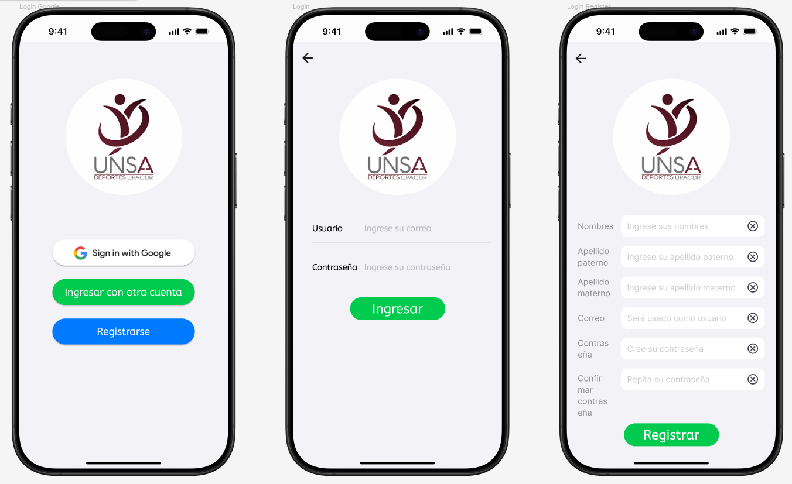

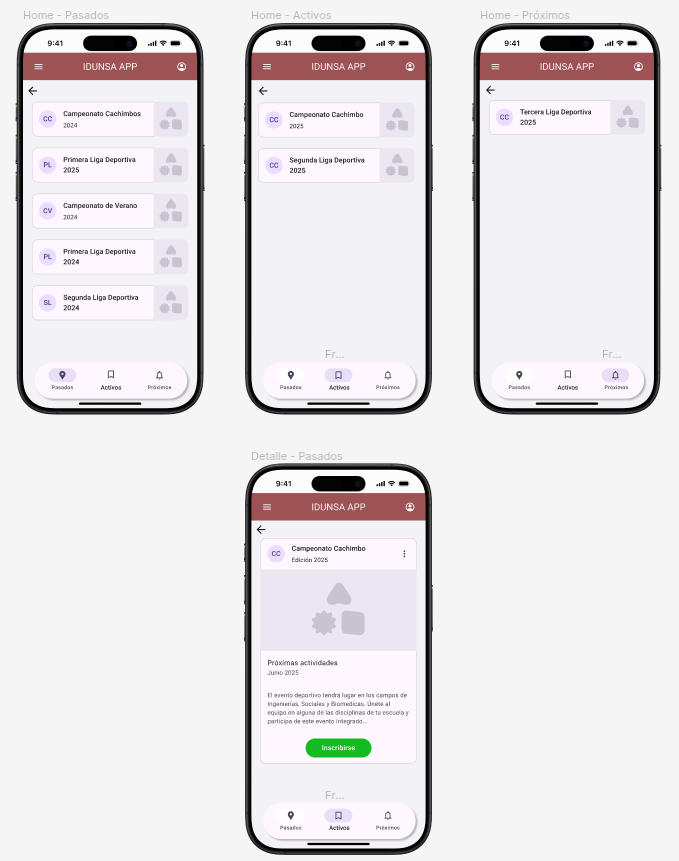

Las interfaces fueron desarrolladas en [Figma](https://www.figma.com/proto/KOyBwW53udcyf76ax6r5Hf/IDUNSA-APP-MOBILE?node-id=5-230&p=f&t=O2pWYph2g76XQQkZ-1&scaling=min-zoom&content-scaling=fixed&page-id=0%3A1&starting-point-node-id=5%3A230)

---

## 🧩 Modelo de Dominio

### Diagrama de Clases

<!-- Inserta aquí el diagrama de clases -->
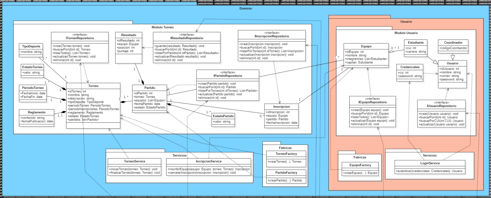

La arquitectura del sistema está modelada bajo un enfoque de **Domain-Driven Design (DDD)** y sigue una estructura **en capas**, lo que permite una clara separación de responsabilidades, facilita la escalabilidad y mejora el mantenimiento del sistema.

### 🔹 Capa de Dominio

Contiene la lógica de negocio central del sistema:

- **Módulo Torneo**: Define entidades, reglas y comportamientos relacionados con torneos (partidos, fechas, fixture, participantes).
- **Módulo Usuario**: Modela los roles del sistema como estudiantes y organizadores.
- **Servicios de Dominio**: Operaciones que no pertenecen a una sola entidad pero representan lógica del negocio.
- **Fábricas**: Encargadas de la creación controlada de entidades agregadas respetando invariantes del dominio.

### 🔹 Capa de Persistencia (Repositorios)

Implementada con **JPA**, esta capa abstrae el acceso a la base de datos:

- **Interfaces de Repositorio**: Declaraciones que representan contratos del dominio.
- **Implementaciones JPA**: Adaptadores que traducen las operaciones del dominio a consultas de base de datos.

### 🔹 Capa de Aplicación (Servicios)

Encargada de orquestar los casos de uso del sistema:

- **Servicios de Aplicación**: Coordinan la ejecución de lógica de negocio, sin contener lógica del dominio directamente.

### 🔹 Capa de Presentación

Expone la funcionalidad del sistema a los usuarios:

- **Controladores REST (Spring Boot)**: Gestionan solicitudes HTTP y exponen los endpoints del sistema.
- **Aplicación Móvil (Android Studio)**: Interfaz gráfica que consume los servicios y proporciona una experiencia de usuario intuitiva.

---

Esta arquitectura promueve el desarrollo modular, desacoplado y orientado a negocio, y sienta las bases para futuras integraciones, autenticación segura y analítica en tiempo real.

---

## 🏗️ Visión General de Arquitectura

### Arquitectura Aplicada

Mediante la estructura de un proyecto bajo el marco de trabajo SpringBoot se aplicó el enfoque **Domain-Driven Design (DDD)** y **Arquitectura Limpia** para la separación de responsabilidades y escalabilidad.

```plaintext
src/
└── main/
    ├── java/
    │   └── com/
    │       └── idunsa/
    │           └── app/
    │               ├── AppIdunsaApplication.java  # Clase principal (Spring Boot)
    │
    │               ├── dominio/                   # 🧠 Capa de dominio (pura)
    │               │   ├── torneo/
    │               │   │   ├── Torneo.java
    │               │   │   ├── Partido.java
    │               │   │   ├── TorneoFactory.java
    │               │   │   └── TorneoService.java
    │               │   ├── usuario/
    │               │   │   ├── Usuario.java
    │               │   │   └── RolUsuario.java
    │               │   └── comunes/
    │               │       └── Identificador.java
    │
    │               ├── aplicacion/                # 🔁 Capa de aplicación (casos de uso)
    │               │   ├── servicios/
    │               │   │   └── GestionTorneoService.java
    │               │   └── dtos/
    │               │       └── CrearTorneoDTO.java
    │
    │               ├── infraestructura/           # 🗃️ Adaptadores de salida (JPA, APIs, etc.)
    │               │   ├── persistencia/
    │               │   │   ├── repositorios/
    │               │   │   │   └── TorneoJpaRepository.java
    │               │   │   └── entidades/
    │               │   │       └── TorneoEntity.java
    │               │   └── configuracion/
    │               │       └── PersistenciaConfig.java
    │
    │               ├── interfaz/                  # 🌐 Adaptadores de entrada (controladores)
    │               │   ├── rest/
    │               │   │   └── TorneoController.java
    │               │   └── excepciones/
    │               │       └── ManejadorGlobal.java
    │
    │               └── configuracion/             # ⚙️ Config global de Spring (CORS, beans, etc.)
    │                   └── SeguridadConfig.java
    │
    └── resources/
        ├── application.yml
        └── templates/ (si usas Thymeleaf, por ejemplo)
```

### Diagrama de Paquetes

<!-- Inserta aquí tu diagrama de paquetes -->
La estructura del proyecto sigue una arquitectura en capas organizada en paquetes, orientada a principios de Clean Architecture y DDD:

- `com.idunsa.backend.controller`  
  Contiene los **controladores REST** que exponen los endpoints HTTP. Representa la **capa de presentación** o interfaz del sistema.

- `com.idunsa.backend.domain`  
  Incluye las **entidades del dominio** y la **lógica de negocio central**, como modelos, agregados, y servicios del dominio. Esta capa es **independiente** de frameworks y bibliotecas externas.

- `com.idunsa.backend.dto`  
  Contiene los **Data Transfer Objects** que permiten la comunicación entre capas, evitando exponer directamente las entidades del dominio.

- `com.idunsa.backend.repository`  
  Define las **interfaces de persistencia** (repositorios) y sus implementaciones, generalmente integradas con JPA/Hibernate. Representa la infraestructura de acceso a datos.

- `com.idunsa.backend.service`  
  Contiene la **lógica de aplicación**, orquestando el flujo entre controladores, dominio y repositorios. Aquí se ubican los servicios que implementan los casos de uso del sistema.

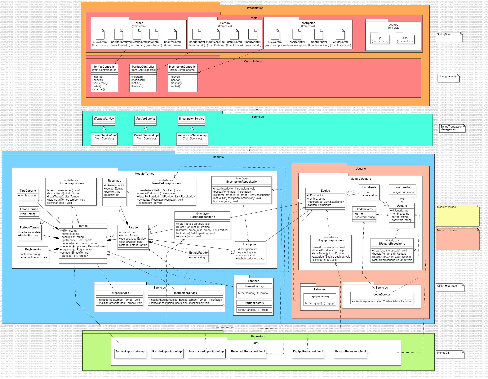

---

### 🧠 Prácticas de Desarrollo Aplicadas:

#### 🔹 Estilos de Programación:

##### 1. Persistent-Tables

```kotlin
@Entity
data class Torneo(
    @Id
    @GeneratedValue(strategy = GenerationType.IDENTITY)
    val id: Long = 0,

    var nombre: String = "",
    var fecha: LocalDate = LocalDate.now(),
    var hora: LocalTime = LocalTime.now(),
    var direccion: String = "",

    @ManyToOne(fetch = FetchType.LAZY)
    @JoinColumn(name = "evento_id")
    var evento: Evento? = null,

    @ManyToOne(fetch = FetchType.LAZY)
    @JoinColumn(name = "deporte_id", nullable = false)
    var deporte: Deporte? = null,

    @Column(columnDefinition = "TEXT")
    var reglamento: String? = null

)
```

El uso de la anotación @Entity de JPA/Hibernate, que indica que la clase Torneo representa una tabla persistente en una base de datos relacional. Las anotaciones como @Id, @GeneratedValue, @ManyToOne, y @JoinColumn son típicas del mapeo objeto-relacional (ORM), que es característico del estilo Persistent-Tables.

##### 2. Things

```kotlin
data class TorneoRequestDTO(
    val nombre: String,
    val fecha: String,
    val hora: String,
    val direccion: String,
    val eventoId: Long,
    val deporteId: Int 
)
```

El código define un DTO (Data Transfer Object), que es una estructura de datos simple utilizada para transportar información entre procesos, capas o servicios. No contiene lógica de negocio ni comportamiento, solo datos agrupados, lo cual es característico del estilo Things (objetos que representan cosas o datos).

##### 3. RESTful

```kotlin
@RestController
@RequestMapping("/api/deportes")
class DeporteController(
    private val deporteService: DeporteService
) {

    @GetMapping
    fun obtenerDeportes(): List<DeporteResponseDTO> {
        return deporteService.obtenerTodos()
    }

    @GetMapping("/buscar")
    fun obtenerDeportePorNombre(@RequestParam nombre: String): ResponseEntity<DeporteResponseDTO> {
        val deporte = deporteService.obtenerPorNombre(nombre)
            ?: return ResponseEntity.notFound().build()
        return ResponseEntity.ok(deporte)
    }
}
```

El uso de anotaciones como @RestController, @RequestMapping, @GetMapping indica que este controlador expone una API web siguiendo el estilo arquitectónico REST. Los métodos corresponden a endpoints HTTP (GET), devolviendo recursos o respuestas HTTP (ResponseEntity).

##### 4. Error/Exception Handling

```kotlin
class TorneoService(
    private val torneoRepository: TorneoRepository,
    private val eventoRepository: EventoRepository,
    private val deporteRepository: DeporteRepository

) {

    fun crearTorneo(request: TorneoRequestDTO): TorneoResponseDTO {
        val evento = eventoRepository.findById(request.eventoId)
            .orElseThrow { RuntimeException("Evento con ID ${request.eventoId} no encontrado") }

        val deporte = deporteRepository.findById(request.deporteId)
            .orElseThrow { RuntimeException("Deporte con ID ${request.deporteId} no encontrado") }
        .
        .
        .
}
```

Se utiliza el manejo de excepciones para controlar errores, por ejemplo, con orElseThrow { RuntimeException("...") } cuando no se encuentra un recurso en la base de datos.

#### 🔹 Prácticas de Codificación Limpia - Clean Code:

##### 1. Definir constantes

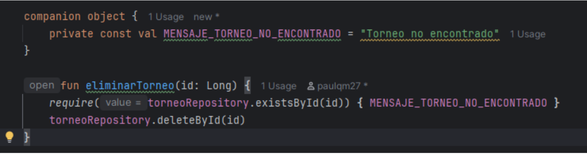

Definir constantes es una práctica recomendada dentro del enfoque de **Clean Code** por las siguientes razones:

- **Evita duplicación:** Se cumple la regla **DRY** (*Don’t Repeat Yourself*), reduciendo el código repetido.
- **Facilita el mantenimiento:** Cualquier cambio en los valores solo se realiza en un único lugar.
- **Mejora la legibilidad:** Las constantes descriptivas hacen que el código sea más claro y entendible.
- **Prepara el sistema para internacionalización:** Centralizar mensajes facilita adaptarlos a múltiples idiomas en el futuro.

##### 2. Manejo de excepciones

Antes
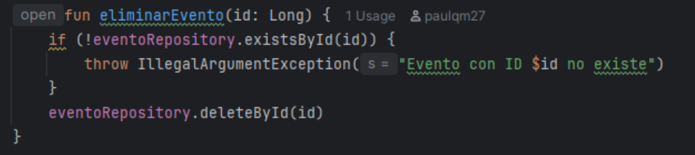

Ahora
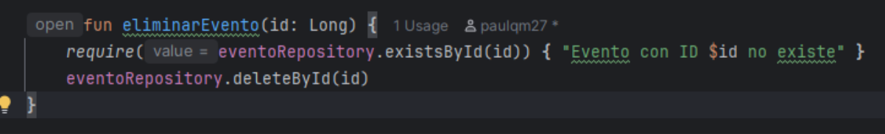

Por qué es Clean Code?

- **Claridad:** *require* expresa claramente que el método espera que la condición sea verdadera para continuar.
- **Concisión:** Queda claro que es una precondición que debe cumplirse.
- **Consistencia:** *require* es una práctica estándar en Kotlin para validar argumentos o estados previos.

##### 3. Estructura de Código Fuente

```kotlin
private fun convertirAResponseDTO(torneo: Torneo): TorneoResponseDTO {
    val deporte = torneo.deporte!!

    return TorneoResponseDTO(
        id = torneo.id,
        nombre = torneo.nombre,
        fecha = torneo.fecha.toString(),
        hora = torneo.hora.toString(),
        direccion = torneo.direccion,
        reglamento = torneo.reglamento,
        eventoId = torneo.evento?.id ?: 0L,
        deporte = DeporteResponseDTO(
            id = deporte.id,
            nombre = deporte.nombre,
            jugadores = deporte.jugadores,
            suplentes = deporte.suplentes,
            tipo = deporte.tipo
        )
    )
}

```

Por qué es Clean Code?

- **Evita duplicación de lógica:** Centraliza la conversión, reutilizada por múltiples métodos (crearTorneo, obtenerTorneosPorEvento, etc.).
- **Responsabilidad Única:** Esta función tiene una única responsabilidad: convertir una entidad Torneo a su DTO correspondiente.
- **Abstracción:** Se oculta la lógica de mapeo entre entidades y DTOs, evitando que el resto del servicio repita esa lógica.
- **Formato legible:** El retorno del DTO está bien estructurado, cada campo ocupa su propia línea, lo que mejora la legibilidad.

##### 4. Estructura de Datos

```kotlin
val torneo = Torneo(
    nombre = request.nombre,
    fecha = LocalDate.parse(request.fecha),    
    hora = LocalTime.parse(request.hora),       
    direccion = request.direccion,
    evento = evento,
    deporte = deporte
)

val guardado = torneoRepository.save(torneo)
```

El objeto Torneo es una estructura de datos orientada al dominio, definida mediante una clase de datos (data class), lo cual:

- **Agrupa de forma coherente:** Los atributos relacionados a un torneo (nombre, fecha, hora, dirección, etc.).
- **Encapsula:** El estado del objeto dentro de una sola entidad.
- **Facilita la manipulación:** Del objeto como unidad lógica, alineado con el diseño orientado a objetos.

##### 5. Tratamiento de Errores

```kotlin
fun obtenerDeportePorNombre(@RequestParam nombre: String): ResponseEntity<DeporteResponseDTO> {
    val deporte = deporteService.obtenerPorNombre(nombre)
        ?: return ResponseEntity.notFound().build()
    return ResponseEntity.ok(deporte)
}
```

Se aplica un patrón de manejo de errores temprano (early return) cuando no se encuentra el recurso:

- **Código conciso y expresivo:** Usa el operador Elvis (?:) de Kotlin, lo que lo hace conciso y expresivo sin perder claridad.
- **Separación de responsabilidades:** La lógica de negocio está delegada al servicio deporteService, no al controlador.

#### 🔹 Principios SOLID:

##### 1. Single Responsibility Principle (SRP)


```kotlin
fun obtenerDeportePorNombre(@RequestParam nombre: String): ResponseEntity<DeporteResponseDTO> {
    val deporte = deporteService.obtenerPorNombre(nombre)
        ?: return ResponseEntity.notFound().build()
    return ResponseEntity.ok(deporte)
}
```

##### 2. Open-Closed Principle (OCP)

```kotlin
interface TorneoRepository : JpaRepository<Torneo, Long> {
   fun findByEventoId(eventoId: Long): List<Torneo>
   fun findByNombreContainingIgnoreCase(nombre: String): List<Torneo>
}
```

La interfaz extiende de JpaRepository, por lo que ya realiza funciones propias de un CRUD, pero sin modificar las funcionalidades existentes, sin embargo puede extenderse fácilmente con nuevos métodos, podría agregarse nuevos métodos personalizados.

##### 3. Liskov Substitution Principle (LSP)

```kotlin
@Entity
@Table(name = "usuario")
data class Usuario(

   @Id
   @Column(name = "cui", nullable = false, unique = true)
   val cui: Int = 0,

   @Column(name = "nombre", nullable = false)
   val nombre: String = "",

   @Column(name = "apellido", nullable = false)
   val apellido: String = "",

   @Column(name = "email", nullable = false, unique = true)
   val email: String = "",

   @Column(name = "password", nullable = false)
   val password: String = "",

   @Column(name = "escuela")
   val escuela: String = "",

   @Column(name = "rol", nullable = false)
   val rol: String = "ESTUDIANTE"
)
```

El principio se cumple en la clase Usuario, dado que si en el futuro se decide extender Usuario o envolverlo en un adaptador o interfaz, cualquier instancia de Usuario se podrá sustituir sin generar errores.

##### 4. Interface Segregation Principle (ISP)

```kotlin
interface EquipoRepository : JpaRepository<Equipo, Long> {
    fun findByTorneoId(torneoId: Long): List<Equipo>
    fun findByNombre(nombre: String): Equipo?
}
```

EquipoRepository extiende de JpaRepository<Equipo, Long>, que es una interfaz genérica y reutilizable de Spring Data JPA. Solo se definen métodos específicos y necesarios para el repositorio de torneos (findByTorneoId, findByNombre), evitando métodos innecesarios.

##### 5. Dependency Inversion Principle (DIP)

```kotlin
@RestController
@RequestMapping("/api/torneos")
class TorneoController(
    private val torneoService: TorneoService
) {

    @PostMapping
    fun crearTorneo(@RequestBody request: TorneoRequestDTO): ResponseEntity<TorneoResponseDTO> {
        val torneo = torneoService.crearTorneo(request)
        return ResponseEntity.status(HttpStatus.CREATED).body(torneo)
    }

    @GetMapping("/evento/{eventoId}")
    fun obtenerTorneosPorEvento(@PathVariable eventoId: Long): ResponseEntity<List<TorneoResponseDTO>> {
        val torneos = torneoService.obtenerTorneosPorEvento(eventoId)
        return ResponseEntity.ok(torneos)
    }

    
    @DeleteMapping("/{id}")
    fun eliminarTorneo(@PathVariable id: Long): ResponseEntity<Void> {
        torneoService.eliminarTorneo(id)
        return ResponseEntity.noContent().build()
    }


    @PutMapping("/{id}")
    fun actualizarTorneo(
        @PathVariable id: Long,
        @RequestBody request: TorneoRequestDTO
    ): ResponseEntity<TorneoResponseDTO> {
        val actualizado = torneoService.actualizarTorneo(id, request)
        return ResponseEntity.ok(actualizado)
    }

    @GetMapping("/{id}")
    fun obtenerTorneoPorId(@PathVariable id: Long): ResponseEntity<TorneoResponseDTO> {
        val torneo = torneoService.obtenerTorneoPorId(id)
        return ResponseEntity.ok(torneo)
    }

    @PatchMapping("/{id}/reglamento")
    fun actualizarReglamento(
        @PathVariable id: Long,
        @RequestBody body: Map<String, String?>
    ): ResponseEntity<TorneoResponseDTO> {
        val nuevoReglamento = body["reglamento"]
        val actualizado = torneoService.actualizarReglamento(id, nuevoReglamento)
        return ResponseEntity.ok(actualizado)
    }

}
```

El controlador no crea ni gestiona directamente dependencias concretas, sino que recibe sus dependencias desde el exterior (inyección de dependencias), cumpliendo así con el DIP.

---

#### 🔹 Domain-driven design:

##### 1. Entidades

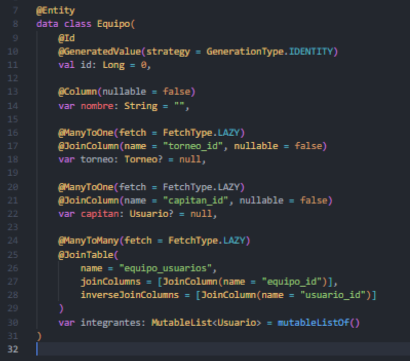

##### 2. Objetos de Valor


##### 3. Servicios de Dominio

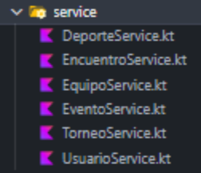

Cabe mencionar que el proyecto solo cuanto son servicio de aplicación:

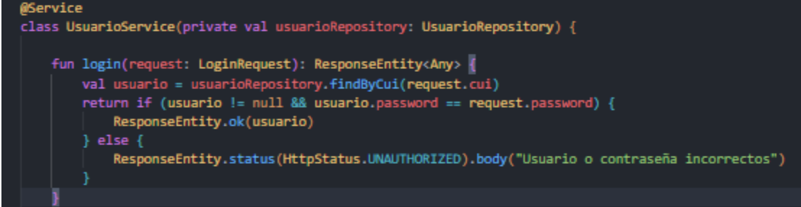

##### 4. Agregados

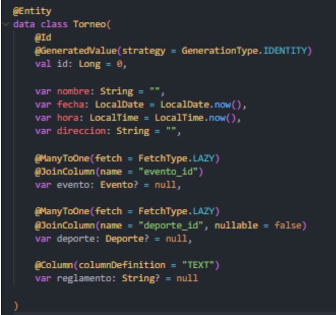

El torneo actúa como entidad raíz del agregado que agrupa y coordina:

- Equipos participantes.
- Encuentros (partidos) definidos dentro del torneo.
- Reglas del torneo (campo reglamento).
- Asociación a un evento y a un deporte.

##### 5. Modulos


##### 6. Repositorios

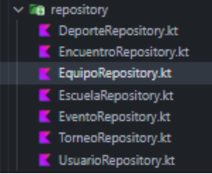

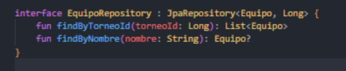

---

#### 🔹 Estilos o Patrones de Arquitectura:

##### Capas: Presentación, Aplicación y Dominio

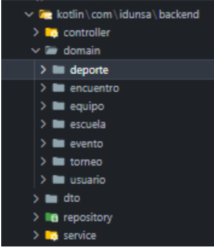

Nuestra arquitectura sigue un enfoque por capas. Separamos:

- **Capa de Presentación:** Controllers que exponen endpoints REST.
- **Capa de Aplicación:** Servicios que contienen la lógica de orquestación del dominio.
- **Capa de Dominio:** Entidades agrupadas por contexto (Domain/), con lógica de negocio.
- También usamos DTOs para el transporte de datos entre capas, evitando el acoplamiento directo con las entidades.

---

### ⚙️ Gestión de Proyecto:

Las gestiónes de desarrollo en equipos se realizaron con la herramienta Trello:

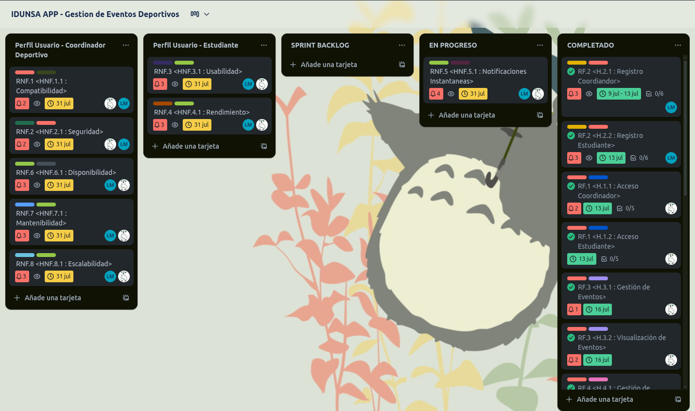

Enlace a [Trello](https://trello.com/invite/b/682c0773f278198ff928e567/ATTIf7f6967ec48dcb9369f59aa235ceb7689F4B2953/idunsa-app-gestion-de-eventos-deportivos) del proyecto.
